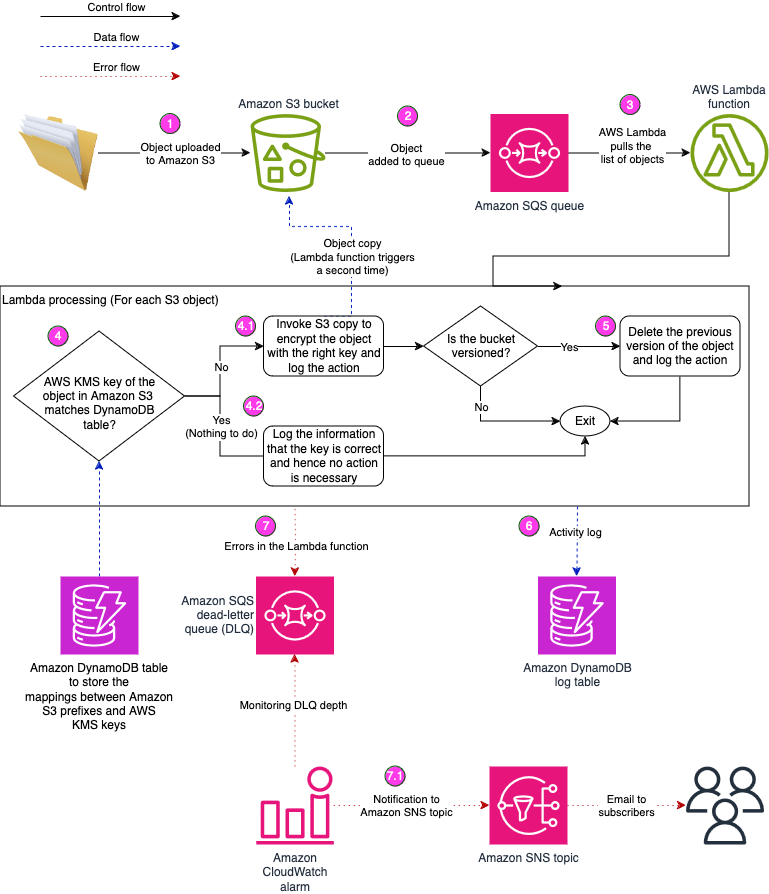

# S3 Prefix level keys

## __Table of Contents__
1. [Description](#1-description)
2. [Motivation](#2-motivation)
3. [Prerequisites](#3-prerequisites)
4. [Installation](#4-installation)
5. [Creating an S3 Bucket and 3 KMS keys for a Demo](#5-creating-an-s3-bucket-and-3-kms-keys-for-a-demo)
6. [Testing](#6-testing)
7. [Design](#7-design)
8. [Caveats](#8-caveats)
9. [Security](#9-security)
10. [License](#10-license)

## __1. Description__
This is a demo of an approach to enforce Prefix level KMS keys on S3.

At the moment, S3 supports [default bucket keys](https://docs.aws.amazon.com/AmazonS3/latest/userguide/bucket-encryption.html) that is used automatically to encrypt objects to that bucket. But no such feature exists for prefixes, (i.e) you might want to use different keys for different prefixes within the same bucket (rather than one key for the entire bucket). This project shows a potential solution on how to enforce prefix level KMS keys.

This set up has two sets of components:
* The core set of components contains all the resources needed to enforce KMS keys at a prefix level. This set contains the following components:
    * The Lambda function that is triggered when any object is uploaded to an S3 bucket. This Lambda enforces the right KMS key for prefix.
    * The Dynamo DB table that contains the mapping (configuration) of which prefix needs to be encrypted with which KMS key.
* The demo set of components which contains a sample S3 bucket and 3 KMS keys just to demonstrate how the core set of components enforces the keys on the prefixes.

Given below is how the flow of what happens when an object is uploaded to the S3 bucket.



Please read the Caveats section below before you start using this in production.

## __2. Motivation__

You might have a need to have different keys for objects with different prefixes. This is common in multi-tenant buckets where each prefix belongs to a different tenant and thus needs a different KMS key.

In such cases, rather than relying on all applications writing to the bucket to use the right key all the time, you can have a Lambda based set up so that, even if someone or some application writes an object without a key or with a wrong key, this solution will remedy that.

## __3. Prerequisites__

This set up uses [AWS Cloud Development Kit (CDK)](https://docs.aws.amazon.com/cdk/v2/guide/home.html).

To install CDK please follow the steps in the [Getting Started](https://docs.aws.amazon.com/cdk/v2/guide/getting_started.html) page.

## __4. Installation__

Clone the [git repo](https://github.com/aws-samples/s3-prefix-level-kms-keys/) with the following command

```
git clone git@github.com:aws-samples/s3-prefix-level-kms-keys.git
```

Change into the repo directory with the following command.

```
cd s3-prefix-level-kms-keys
```

The initialization process also creates a virtualenv within this project, stored under the `.venv` directory.  To create the virtualenv it assumes that there is a `python3` (or `python` for Windows) executable in your path with access to the `venv` package. If for any reason the automatic creation of the virtualenv fails, you can create the virtualenv manually.

To manually create a virtualenv on MacOS and Linux:

```
python3 -m venv .venv
```

After the init process completes and the virtualenv is created, you can use the following step to activate your virtualenv.

```
source .venv/bin/activate
```

If you are on a Windows platform, you would activate the virtualenv like this:

```
% .venv\Scripts\activate.bat
```

Once the virtualenv is activated, you can install the required dependencies.

```
pip3 install -r requirements.txt
```

At this point you are ready to deploy the necessary templates. This project is structured in CDK in the following manner. There are 3 stack definitions.
1. Core Stack - This is the stack that contains the Lambda functions, Dynamo DB table, SQS queue etc., all of which are necessary to enforce prefix level keys. There will be only one instance of this stack.
2. Integration Stack - This is a nested stack within the "Core Stack". An integration stack contains the necessary configuration and permissions that are needed for the Core Stack to enforce the prefix level keys on a single bucket. For example, to enforce the keys, the core stack's DDB table needs to have the mapping for all the prefixes and the corresponding KMS key arns. The core stack's lambda function must also be able to access the files in the bucket it is enforcing prefix level kms keys in. There will be one instance of this stack for every bucket enforced by the core stack. This way, adding and removig new buckets is clean. You do not need to explicitly create this. The Core Stack creates the necessary number of Integration Stacks based on the information availablle in the "input.json" file.
3. Demo Stack - This is a stack you will not need when you implement this solution for your own buckets. But just to show how the Core Stack works this Demo Stack creates an S3 bucket and 3 KMS keys for the prefixes "prefix1", "prefix2", "prefix3". When you want to use the "Core Stack" to enforce PLKK on one of your own buckets, only the Core Stack (and the nested Integration stacks) will be needed as the buckets and KMS keys will already be available from one of your existing Stacks.

Change into the cdk directory with the following command
```
cd cdk
```

Let us first install the Core stack with the following command. The email address provided here will receive notifications if there are any failures in correcting the KMS keys of S3 objects. So make sure you modify the email address.

```
cdk deploy --context error_notification_email=abc@example.com  --context no_buckets_configured=true S3PrefixLevelKeys --app "python3 app.py"
```

Please note that we are pasing in the "no_buckets_configured" context variable just because this is the first time we are creating the core stack and we do not have any buckets configured for Prefix level key enforcement. If you are implementing this solution, you will have to use this flag only the very first time. Every time after that you will have to use the input_file_name context variable as described in the next section.

Once you run the `cdk deploy` You will get a prompt to confirm IAM changes. Please press Y if you are comfortable with the changes being proposed.

Once the Stack is deployed you should see the output variables as below.

```
Outputs:
S3PrefixLevelKeys.DDBLogTableName = DemoStackForS3PrefixLevelKeys-PrefixLevelKeysLogTable8A4126D0-10IZUVOS56LQS
S3PrefixLevelKeys.DDBMappingTableName = DemoStackForS3PrefixLevelKeys-PrefixLevelKeysMappingTable12345678-AB4C3DE0FGHI
```
Export the values of S3PrefixLevelKeys.DDBMappingTableName and S3PrefixLevelKeys.DDBLogTableName (from the core stack) and DemoForS3PrefixLevelKeys1.S3BucketName (from the Demo stack) as env variables as below:

```
export MAPPING_TABLE_NAME=S3PrefixLevelKeys-PrefixLevelKeysMappingTable12345678-AB4C3DE0FGHI
export LOG_TABLE_NAME=S3PrefixLevelKeys-PrefixLevelKeysLogTable8A4126D0-10IZUVOS56LQS
```

Once deployed, You will also receive an email with the subject "AWS Notification - Subscription Confirmation" from `no-reply@sns.amazonaws.com` asking you to confirm subscription to an SNS topic. Please confirm the subscription by clicking on the link in the email, so that you receive notifications in case of errors.
 
The DynamoDB logs table will be, by default, deleted on deletion of this stack. If you want to retain it, then pass in the context variable retain_ddb_logs_table as True (either as a string at command line, or as a boolean in the cdk.json file)

## __5. Creating an S3 Bucket and 3 KMS keys for a Demo__ ##

If you want to test this solution with your own pre-existing bucket and KMS keys, please skip this section and move to the next one. But, if you want to create an S3 bucket and three KMS keys for testing purposes, then run the following command. [Note: use DemoForS3PrefixLevelKeys2 if you want to do a demo with a versioned bucket. The remaining steps are pretty much the same]

```
cdk deploy DemoForS3PrefixLevelKeys1  --app "python3 app.py"
```

You will get a prompt to confirm the IAM changes. Please press Y if you are comfortable with the changes being proposed. Once deployment finishes you will see output of each stack that will look like this:

```
DemoForS3PrefixLevelKeys1.OutputKeyforprefix1 = arn:aws:kms:us-east-1:111222333444:key/aaaaaaa-1234-12ab-34cd-111111111111
DemoForS3PrefixLevelKeys1.OutputKeyforprefix2 = arn:aws:kms:us-east-1:111222333444:key/aaaaaaa-1234-12ab-34cd-222222222222
DemoForS3PrefixLevelKeys1.OutputKeyforprefix3 = arn:aws:kms:us-east-1:111222333444:key/aaaaaaa-1234-12ab-34cd-333333333333
DemoForS3PrefixLevelKeys1.S3BucketName = demostackfors3prefixleve-prefixlevelkeysdemobucke-a0bc1defg234
```

## __6. Testing__ ##

To test the set up, you will need one bucket and some KMS keys with which you want to encrypt specific prefixes inside that bucket. You can either use the one created in the previous section (if you went through that) or you can use your own (in which case use your bucket name and the KMS key arns for the rest of this section).

Export the S3 bucket as an environment variable with the command below:
```
export BUCKET_NAME=demostackfors3prefixleve-prefixlevelkeysdemobucke-a0bc1defg234
```

Create two json files. The first one can be called bucket1.json. This must provide the mappings from prefixes (within the bucket) to KMS keys with which objects with those prefixes need to be encrypted. Each key at the top level is a prefix. Each prefix contains the corresponding KMS key ARN and a boolean value of whether objects in that prefix have to be encrypted with Dual Layer Encryption. If you have more than one bucket, then you will need to create multiple files (one for each bucket) structured as below.

__bucket1.json__
```
{
    "bucket1prefix1": {
        "kms_key_arn": "arn:aws:kms:us-east-1:111222333444:key/aaaaaaa-1234-12ab-34cd-111111111111",
        "dual_layer_encryption": false
    },
    "bucket1prefix2": {
        "kms_key_arn": "arn:aws:kms:us-east-1:111222333444:key/aaaaaaa-1234-12ab-34cd-111111111111",
        "dual_layer_encryption": false
    },
    "bucket1prefix3": {
        "kms_key_arn": "arn:aws:kms:us-east-1:111222333444:key/aaaaaaa-1234-12ab-34cd-111111111111",
        "dual_layer_encryption": true
    }
}
```

Now create a file called input.json with the structure as below. The top level keys in this file are bucket names that contain the corresponding mapping information file name. Again, if you are using your own bucket use that bucket name in this file.

__input.json__

```
{
  "demostackfors3prefixleve-prefixlevelkeysdemobucke-a0bc1defg234": {
    "mapping_file_name": "bucket1.json"
  }
}
```

If you have more than one bucket, then this file can be expanded to point to the mapping data for other buckets as below. This is not needed for this test we are working with a single bucket.
```
{
  "demostackfors3prefixleve-prefixlevelkeysdemobucke-a0bc1defg234": {
    "mapping_file_name": "bucket1.json"
  },
  "demostackfors3prefixleve-prefixlevelkeysdemobucke-x0yz1tuvw234": {
    "mapping_file_name": "bucket2.json"
  }
}
```

Now use the following command to deploy the "Core" stack S3PrefixLevelKeys again but this time provide the input_file_name as input.json.

```
cdk deploy --context error_notification_email=mvishnub@amazon.com --context input_file_name=input.json S3PrefixLevelKeys --app "python3 app.py"
```

This command will deploy (within the "Core" stack) a nested "Integration" stack for each bucket. This "Integration" stack will load the prefix-KMS key mapping information into the DynamoDB table, and set up the necessary S3 notification so that any new file created in this bucket will be processed by this solution.

Once the Integration stack has been created, you can check the configuration on the DynamoDB Mapping table with the following command.
```
aws dynamodb scan --table-name $MAPPING_TABLE_NAME \
    --query 'Items[*].
        {
            "bucket_name": bucket_name.S,
            "prefix": prefix.S, 
            "dual_layer_encryption": dual_layer_encryption.BOOL,
            "kms_key_arn": kms_key_arn.S
        }' \
    --output table
---------------------------------------------------------------------------------------------------------------------------------------------------------------------------------------
|                                                                                        Scan                                                                                         |
+-----------------------------------------------------------------+------------------------+-------------------------------------------------------------------------------+----------+
|                           bucket_name                           | dual_layer_encryption  |                                  kms_key_arn                                  | prefix   |
+-----------------------------------------------------------------+------------------------+-------------------------------------------------------------------------------+----------+
|  demostackfors3prefixleve-prefixlevelkeysdemobucke-a0bc1defg234 |  False                 |  arn:aws:kms:us-east-1:1112222333444:key/aaaaaaa-1234-12ab-34cd-111111111111  |  prefix1 |
|  demostackfors3prefixleve-prefixlevelkeysdemobucke-a0bc1defg234 |  False                 |  arn:aws:kms:us-east-1:1112222333444:key/aaaaaaa-1234-12ab-34cd-222222222222  |  prefix2 |
|  demostackfors3prefixleve-prefixlevelkeysdemobucke-a0bc1defg234 |  True                  |  arn:aws:kms:us-east-1:1112222333444:key/aaaaaaa-1234-12ab-34cd-333333333333  |  prefix3 |
+-----------------------------------------------------------------+------------------------+-------------------------------------------------------------------------------+----------+
```

The above table shows the configuration for each prefix. Notice how each prefix has a different KMS key ARN and that dual_layer_encryption is True for prefix3.

Create an empty file at the command prompt:

```
touch a.txt
```

Now copy this file to each of the three prefixes without providing any KMS key. Also copy it to a fourth prefix for which no key is configured.

```
aws s3 cp ./a.txt s3://$BUCKET_NAME/bucket2prefix1/
aws s3 cp ./a.txt s3://$BUCKET_NAME/bucket2prefix2/
aws s3 cp ./a.txt s3://$BUCKET_NAME/bucket2prefix3/
aws s3 cp ./a.txt s3://$BUCKET_NAME/bucket2prefix4/
```

Once the above commands have completed, get the details of the objects with the commands below:
```
aws s3api head-object --query "[ServerSideEncryption, SSEKMSKeyId]" --bucket $BUCKET_NAME --key bucket1prefix1/a.txt
aws s3api head-object --query "[ServerSideEncryption, SSEKMSKeyId]" --bucket $BUCKET_NAME --key bucket1prefix2/a.txt
aws s3api head-object --query "[ServerSideEncryption, SSEKMSKeyId]" --bucket $BUCKET_NAME --key bucket1prefix3/a.txt
aws s3api head-object --query "[ServerSideEncryption, SSEKMSKeyId]" --bucket $BUCKET_NAME --key bucket1prefix4/a.txt
```

If you run the above commands, immediately after the uploads above, you will see output like this:
```
[
    "AES256",
    null
]
[
    "AES256",
    null
]
[
    "AES256",
    null
]
[
    "AES256",
    null
]
```

Now, wait for a few seconds and run the same commands again.
```
aws s3api head-object --query "[ServerSideEncryption, SSEKMSKeyId]" --bucket $BUCKET_NAME --key bucket1prefix1/a.txt
aws s3api head-object --query "[ServerSideEncryption, SSEKMSKeyId]" --bucket $BUCKET_NAME --key bucket1prefix2/a.txt
aws s3api head-object --query "[ServerSideEncryption, SSEKMSKeyId]" --bucket $BUCKET_NAME --key bucket1prefix3/a.txt
aws s3api head-object --query "[ServerSideEncryption, SSEKMSKeyId]" --bucket $BUCKET_NAME --key bucket1prefix4/a.txt
```

Now you should be something like this for each of the objects.
```
[
    "aws:kms",
    "arn:aws:kms:us-east-1:1112222333444:key/aaaaaaa-1234-12ab-34cd-111111111111"
]
[
    "aws:kms",
    "arn:aws:kms:us-east-1:1112222333444:key/aaaaaaa-1234-12ab-34cd-222222222222"
]
[
    "aws:kms:dsse",
    "arn:aws:kms:us-east-1:1112222333444:key/aaaaaaa-1234-12ab-34cd-333333333333"
]
[
    "AES256",
    null
]
```

For the first three prefixes, you will see that the object has now been encrypted with the right KMS keys.
For prefix3, the ServerSideEncryptionType is aws:kms:dsse. This is because dual_layer_encryption is set to True for prefix3.
For prefix4, since no key was defined, it is left unencrypted with any customer owned or managed KMS key (but it is [encrypted by default using Amazon S3 managed keys](https://docs.aws.amazon.com/AmazonS3/latest/userguide/default-encryption-faq.html)).

You can also query the DynamoDB Log table to see each of the lambda invokes and what lambda did each time.

```
aws dynamodb scan --table-name $LOG_TABLE_NAME \
    --query 'Items[*].
        {
            "s3_object_path": s3_object_path.S,
            "current_timestamp_utc": current_timestamp_utc.S, 
            "action_reason": action_reason.S,
            "action_taken": action_taken.S
        }' \
    --output table
```
The output is like below
```
-----------------------------------------------------------------------------------------------------------------------------------------------------------------------------------
|                                                                                       Scan                                                                                      |
+--------------------------------------------------------------------------+------------------------------------+----------------------------------+------------------------------+
|                               action_reason                              |           action_taken             |      current_timestamp_utc       |        s3_object_path        |
+--------------------------------------------------------------------------+------------------------------------+----------------------------------+------------------------------+
|  No KMS key configured for this object's prefix                          |  None                              |  2023-11-01 14:14:16:116264+0000 |  s3://demo.../prefix4/a.txt  |
|  Incorrect SSE type. Was AES256 whereas it should have been aws:kms:dsse |  Initiated copy with the right key |  2023-11-01 14:14:14:848606+0000 |  s3://demo.../prefix3/a.txt  |
|  Already using the correct key                                           |  None                              |  2023-11-01 14:14:37:377080+0000 |  s3://demo.../prefix3/a.txt  |
|  Incorrect SSE type. Was AES256 whereas it should have been aws:kms      |  Initiated copy with the right key |  2023-11-01 14:14:15:976198+0000 |  s3://demo.../prefix2/a.txt  |
|  Already using the correct key                                           |  None                              |  2023-11-01 14:14:37:736303+0000 |  s3://demo.../prefix2/a.txt  |
|  Incorrect SSE type. Was AES256 whereas it should have been aws:kms      |  Initiated copy with the right key |  2023-11-01 14:14:14:512541+0000 |  s3://demo.../prefix1/a.txt  |
|  Already using the correct key                                           |  None                              |  2023-11-01 14:14:36:756982+0000 |  s3://demo.../prefix1/a.txt  |
+--------------------------------------------------------------------------+------------------------------------+----------------------------------+------------------------------+
```

The above output shows how for prefix1,2 and 3 the lambda is being invoked twice. The first time it modifies the key with a copy which triggers the lambda a second time during which it does nothing. But for prefix4, since no key is defined in the mapping table, it does not do anything the first time and so there is no second invoke.

I have removed some fields when querying the log table, but if you want see all the fields you can use the query below.
```
aws dynamodb scan --table-name $LOG_TABLE_NAME \
    --query 'Items[*].
        {
            "s3_object_path": s3_object_path.S,
            "current_timestamp_utc": current_timestamp_utc.S, 
            "current_sse_type": current_sse_type.S,
            "current_kms_key_arn": current_kms_key_arn.S,
            "new_sse_type": new_sse_type.S,
            "new_kms_key_arn": new_kms_key_arn.S,
            "action_reason": action_reason.S,
            "action_taken": action_taken.S
        }' \
    --output table
```

Once testing is complete, to delete the stacks created, please run the following commands. For each of the commands, press "Y" when cdk asks for confirmation if the stacks can eb deleted.

Delete the core stack
```
cdk destroy S3PrefixLevelKeys
```

Delete the demo bucket stack
```
cdk destroy DemoForS3PrefixLevelKeys1
```

## __7. Design__

The set up involves the following resources:

- SQS Queue - Every time an object is uploaded to the S3 bucket, it is added to the SQS queue via S3 event notifications.
- Lambda Function - This checks if the object uploaded is encrypted with the right key. If not, re-encrypts with the right key.
- KMS keys - One for each prefix
- DynamoDB Mapping Table - Containing mapping between prefixes and KMS keys
And finally
- S3 Bucket - The bucket where objects will be uploaded, and prefix level encryption with the right KMS keys needs to be enforced.

Interaction between the resources:
- The DynamoDB Mapping table contains static information of mapping between prefixes and KMS key ARNs.
- A KMS key is created for each prefix (this demo has 3 prefixes and 3 corresponding keys). The prefixes are just "prefix1/", "prefix2/" and "prefix3/". The goal is to ensure that every object is encrypted with the corresponding KMS key as defined in the Mapping table.
- The S3 bucket has event notification configured so that every time an object is added or updated, the information gets added to an SQS queue. This is achieved with [Amazon S3 event notifications](https://docs.aws.amazon.com/AmazonS3/latest/userguide/EventNotifications.html).
- The Lambda function reads the objects in the SQS queue using [Event Source Mappings](https://docs.aws.amazon.com/lambda/latest/dg/with-sqs.html).
- This Lambda function looks at each object it receives, and then checks if the KMS key with which the object is encrypted matches with the KMS key defined for that suffix in the DynamoDB table. If yes, it does nothing. If not, it initiates a copy to encrypt the object with the correct KMS key.
- This copy that the Lambda initiates will again add the object to the SQS queue due to event notification. So the Lambda will be invoked twice. But this time, since the KMS key of the object matches the KMS key of the prefix in the DynamoDB table, it will not do anything the second time.

## __8. Caveats__ ##
There are some caveats to keep in mind with this solution.

* This solution can handle large objects (for unversioned buckets) but limited to the time out of the Lambda which is 15 minutes. To give you an idea, in tests, we have seen that 100 GB files are copied in about 7 minutes. But if there are batches of files processed by a lambda function, then if some of them fail, only the ones that failed will be tried in the next invocation. For versioned buckets though, the maximum object size is 5 GB.

* This solution works only for the following two encryption types:
    * Server-side encryption with AWS KMS ([SSE-KMS](https://docs.aws.amazon.com/AmazonS3/latest/userguide/UsingKMSEncryption.html))
    * Dual-layer server-side encryption with AWS KMS keys ([DSSE-KMS](https://docs.aws.amazon.com/AmazonS3/latest/userguide/UsingDSSEncryption.html))

* This solution uses S3 event notifications, which are asynchronous. Thus the Lambda function that "corrects" the KMS key will run only *after* a short duration of time from when the object was uploaded. For this period between the upload and this lambda getting triggered, the KMS key would not be enforced (as it would just retain the encryption it had on upload). If your requirement is that the file *never* has the wrong encryption, then this solution will not meet your needs. You might then want to consider enforcing the correct key using the IAM condition keys like [`s3:x-amz-server-side-encryption-aws-kms-key-id` and `s3:x-amz-server-side-encryption`](https://docs.aws.amazon.com/AmazonS3/latest/userguide/list_amazons3.html#amazons3-s3_x-amz-server-side-encryption-aws-kms-key-id). This solution documented here is useful for situations where there are many applications or users accessing a bucket and rather than causing those applications to fail for using the wrong KMS keys (by using IAM condition keys), you want to enforce them asynchronously.

* Since this solution uses S3 event notifications, if the bucket already has S3 event notifications set up for the calls that create new objects, then this solution will not work because there can be only one notification configuration for each API call. In this case, the architecture will have to be modified so that the bucket publishes events to an SNS topic to which your exising target of event notifications subscribes and this sollution's SQS queue too can subscribe to the same topic.

* This solution invokes the Lambda twice for every object addition/update which would lead to additional costs. This is because, when trying to fix the key (in case the key of the object is wrong), the lambda itself invokes the [copy_object](https://boto3.amazonaws.com/v1/documentation/api/latest/reference/services/s3/client/copy_object.html) method. This will, in turn, trigger another S3 event which will trigger the Lambda again. This time though, since the keys will match, no further invokes will be triggered.

* When the file is copied (to fix the encryption key) any ACLs on the uploaded object will be lost. So if you are using ACLs on the bucket this solution might not be suitable for your needs.

* Concurrent/high-frequency writes might lead to a newer version of the object replaced with an older version. (For this paragraph, the word "version" does not refer to S3 versioning, but just refers to the natural English usage of the word "version"). The Lambda function uses a 2-step high level logic. 1/ Check if the key of the object matches that of the prefix (as per the mapping table) and 2/ If it does not match, then initiate a copy. Because they are not part of a transaction, there could be concurrent writes that might lead to unpredictable results. You need to be aware of this possibility to make sure they meet your needs. 
    * If a newer upload of the S3 object completes after the GetObject but before the copy then it would still not be a problem, since the copy call will just act on the latest object.
    * If the newer upload of the S3 object and the Lambda copy are initiated very close to each other, it is not possible to predict which one wins due to a variety of factors ([as documented](https://docs.aws.amazon.com/AmazonS3/latest/userguide/Welcome.html#ConsistencyModel)). In such cases, there is a chance that your newer version is overwritten with the Lambda function's copy, which means that the older version of the object (with the correct encryption key) might end up "winning". If your solution already has concurrent writes, then this is not a "new" problem introduced by this solution, as this solution will probably only increase the probability of such issues happening, but if your solution does not have concurrent writes today, or has a solution to manage concurrent writes so that you avoid race conditions, then this solution might introduce that problem. If your applications do not write files at a high frequency (say the gap between updates is at least 10-15 minutes), then this problem is unlikely to occur.

* In some situations, the latest version of the object might not be the most recent one an application/user uploaded. It can happen in the following situation. Copying an existing version by specifying an encryption key will only create a new version. The existing version will remain unencrypted. The only solution in that case would be to delete the existing version (which is what this solution does for versioned objects). With versioned buckets there is the following potential problem (it might not be an issue depending on your use case). Consider this scenario below. Here too, if your objects do not have high frequency updates, then this problem is unlikely to occur.
    * An unencrypted file is uploaded to the bucket without any encryption or with the "wrong" KMS key (let us call this version V1).
    * The event notification triggers the lambda function.
    * The Lambda function will copy this version to create a new version but encrypted with the right key.
    * But before this copy could be triggered, let us say a new version of the file with the **correct** encryption key is uploaded (say, V2).
    * The Lambda function from the previous invocation now completes the copy thus creating a V3 which is a correctly encrypted version of V1. In such a situation, when V2 is actually the latest version (from a business perspective), the encrypted version of V1 (which is V3) becomes the latest (and V1 is deleted by the solution).
    * If you are sure that new versions of the file will come in, say, only once a day or only once in a few hours, this solution might still work for you, but otherwise, please be aware of this situation where the latest version of the S3 object might not be the latest version that the clients/users uplaoded, but could be the corrected version of an older version.

## __9. Security__

See [CONTRIBUTING](CONTRIBUTING.md#security-issue-notifications) for more information.

## __10. License__

This library is licensed under the MIT-0 License. See the LICENSE file.
